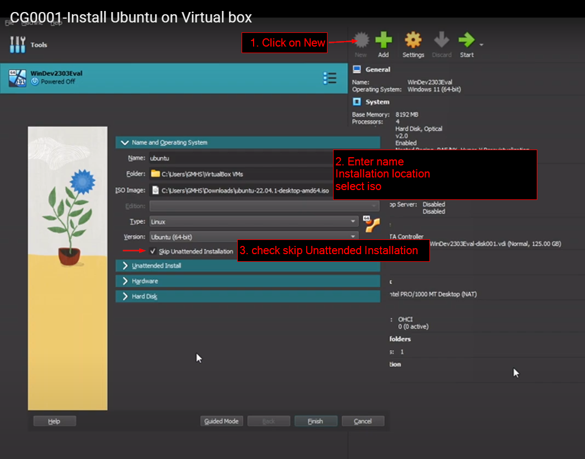
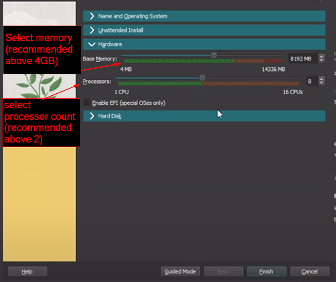
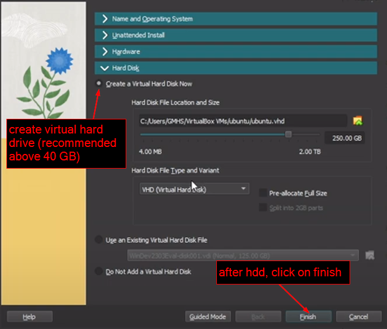
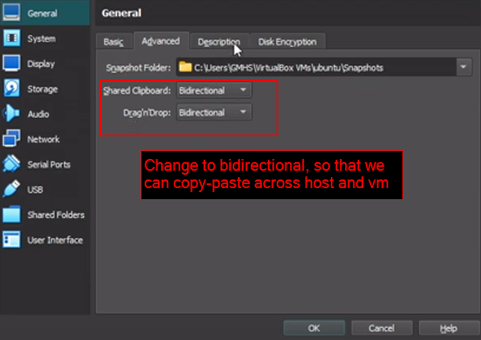
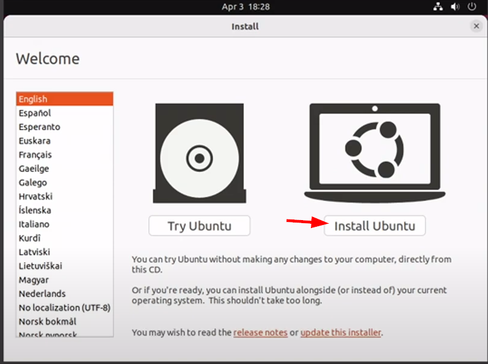

# Install Ubuntu on Virtual box

https://youtu.be/yeMJxAMJfUI

## Create VM

- Download the iso from Ubuntu official website.
  

- After Finish, Select VM and click on settings.
  

- Start Virtual Machine

## Ubuntu Installation

- Select Keyboard layout, continue
- Updates and other software
  - Select **Normal installation**
  - Check **Install third-party software**
  - continue
- Installation type
  - Select **Erase disk and install Ubuntu**
  - Install now
  - continue
- Where are you?
  - Select **your country**
- Who are you?
  - Enter **your name**
  - Enter **username**
  - choose **password**
  - continue
