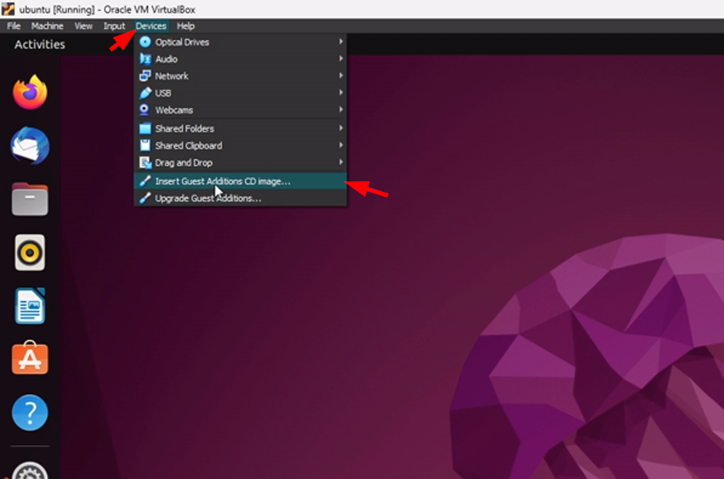
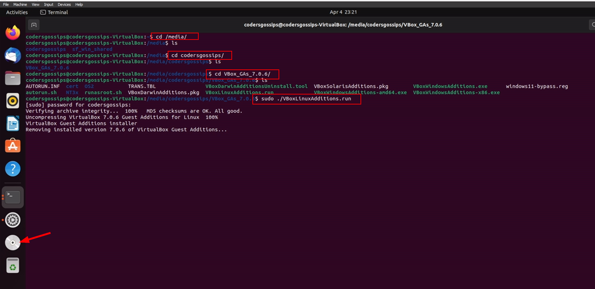
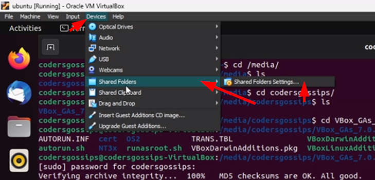
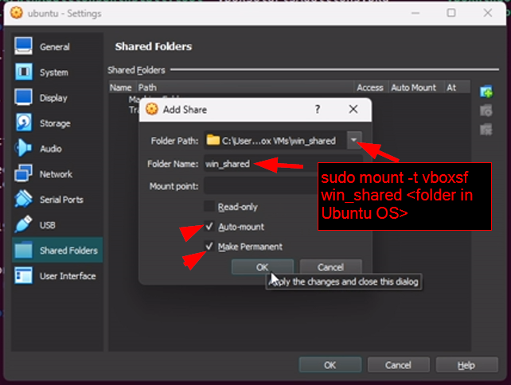

# Create a shared folder between virtual os and host os

<https://youtu.be/GixtTVx_eGc>

## Enable vsboxsf

- start virtual os (Ubuntu)

- open terminal
- cd /media
- cd codersgossips (your user name)
- cd VBox_GAs_7.0.6
- sudo ./VBoxLinuxAdditions.run

## Create a shared folder

- Click on Devices
- Shared Folders
- Shared Folder Setting

- Choose your windows folder
- Enter a folder name
- check **Auto-mount**
- check **Make-Permanent**

## Link folder

- cd ~
- sudo mkdir win_shared
- sudo mount -t vboxsf win_shared ~/win_shared
  - here **win_shared** is same folder name which you given in folder settings.
