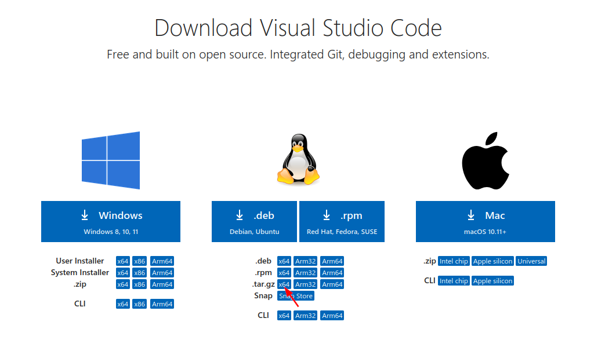

# VSCode custom installation

## Install using snap

```bash
sudo snap install --clasic code
```

### Pros

- supports Auto update

### Cons

- Install in HOME directory (predefined install directory)

## Custom installation

- go to <https://code.visualstudio.com/download>
- Download .tar.gz x64
  
- cd ~/Downloads
- VSDIR=\<Install directory path\>
- mkdir -p $VSDIR
- cd $VSDIR
- mv ~/Downloads/code-stable-x64***.tar.gz .
- tar -xvzf code-stable-x64***.tar.gz
- cd VSCode-linux-x64
- mkdir config
- mkdir extensions
- ./bin/code --user-data-dir $(pwd)/config --extensions-dir $(pwd)/extensions


## Adding alias to bashrc

- gedit ~/.bashrc  (you can use any text editor)
- add below lines at the end of ~/.bashrc

```bash
VSDIR=/home/codersgossips/vscode/VSCode-linux-x64
alias vscode="$VSDIR/bin/code --user-data-dir $VSDIR/config --extensions-dir $VSDIR/extensions"
```

- restart your shell
- To open any file/folder
  - **vscode \<file/folder path\>**

### Pros

- User defined installation directory

### Cons

- Need to update manually
